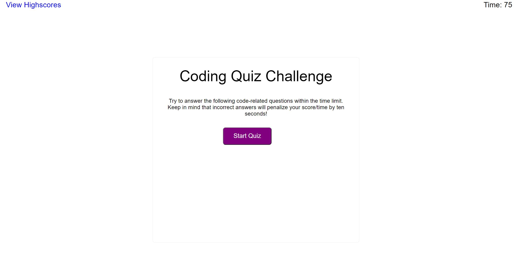

# 04 Web APIs: Code Quiz

## User Story

This application has been created for students of boot camp to test their knowledge on JavaScript fundamentals within a time frame. They can save their score and compare their score to their peers.

To make testing easy, the application is clean and simple to avoid distractions.

## HTML

For this application, a HTML structure was created to display the view score, the timer and the instructions text. A start quiz button is also display.

## CSS

To stylise the HTML for the code quiz and the high score, a style sheet has been created. The makes it clear what the instructions and through colours, font sizes and weights.

Ids have been created in the HTML and JavaScript to apply styling to the quiz questions, answer options and high scores. 

## JavaScript

Questions, answer options and answer are sorted in the Javascript and are render to the page based on click events.

The timer begins once the the start quiz button is clicked on. If the selected answer is wrong, a time penalty is applied. If the quiz is not successfully completed in the 75 seconds, the quiz exits and shows time up. If the quiz is successfully completed then the time remaining is used as the final score.

Final URL: https://shelbyrp.github.io/Code-Quiz

